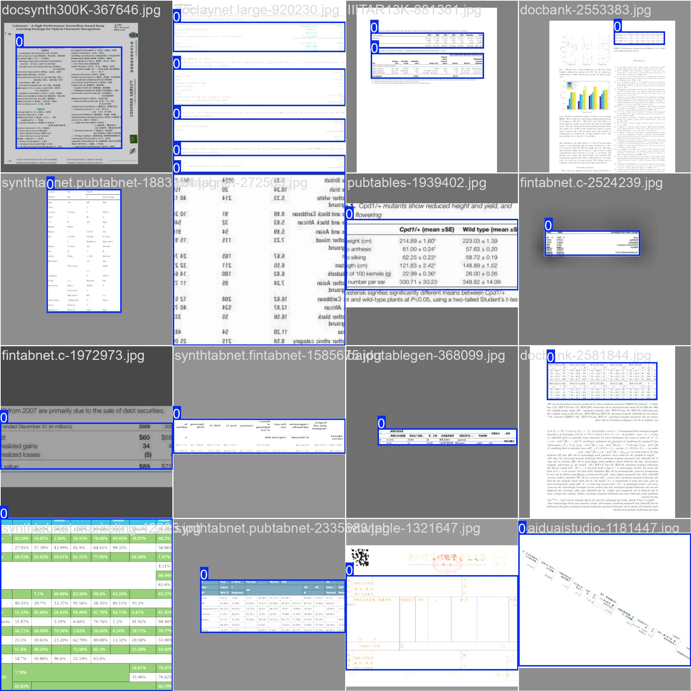

# AnyTable

<a href="https://huggingface.co/oriforge/anytable" target="_blank"></a>
<a href="https://www.modelscope.cn/models/oriforge/table" target="_blank"></a>
<a href="">=3.6-aff.svg"></a>
<a href=""></a>
<a href=""></a>

```
    ___               ______      __    __   
   /   |  ____  __  _/_  __/___ _/ /_  / /__ 
  / /| | / __ \/ / / // / / __ `/ __ \/ / _ \
 / ___ |/ / / / /_/ // / / /_/ / /_/ / /  __/
/_/  |_/_/ /_/\__, //_/  \__,_/_.___/_/\___/ 
             /____/                          

```

English | [简体中文](./README.md)

<div align="left">
    
</div>

## 1. Introduction

AnyTable is a modeling tool that focuses on parsing tables from documents or images, mainly divided into two parts:
-Anytable det: used for table region detection (open)
-Anytable rec: used for table structure recognition (open in the future)

Project Address:
- github地址：[AnyTable](https://github.com/oriforge/anytable)
- Hugging Face: [AnyTable](https://huggingface.co/oriforge/anytable)
- ModelScope: [AnyTable](https://www.modelscope.cn/models/oriforge/anytable)

## 2. Origin

At present, there are a lot of mixed table data on the market, making it difficult to have a clean and complete data and model. Therefore, we collected and organized a lot of table data and trained our model.

Detecting dataset distribution:

- pubtables: 947642
- synthtabnet.marketing: 149999
- tablebank: 278582
- fintabnet.c: 97475
- pubtabnet: 519030
- synthtabnet.sparse: 150000
- synthtabnet.fintabnet: 149999
- docbank: 24517
- synthtabnet.pubtabnet: 150000
- cTDaRTRACKA: 1639
- SciTSR: 14971
- doclaynet.large: 21185
- IIITAR13K: 9905
- selfbuilt: 121157

Total dataset: greater than 2.6M (approximately 2633869 images).

### Train

- train set：`2.6M(Only 42000 samples were taken for the portion greater than 100000，Due to poverty, the cards are limited.)`
- eval set：`4k`
- python: 3.12
- pytorch: 2.6.0
- cuda: 12.3
- ultralytics: 8.3.128

### Model introduction

The table detection model is located in the det folder:

- YOLO series: Training YOLO detection using ultralytics
- Rt detr: Training rt detr detection using ultralytics

Note: You can directly predict the model or fine tune the private dataset as a pre trained model

### Eval

self built evaluation set：`4K`

| model | imgsz | epochs | metrics/precision |
|---|---|---|---|
|rt-detr-l|960|10|0.97|
|yolo11s|960|10|-|
|yolo11m|960|10|0.964|
|yolo12s|960|10|0.978|


## 3. Usage

### Install dependencies

```bash
pip install ultralytics pillow
```

### Usage

```python
## simple
## After downloading the model, simply use ultralytics directly

from ultralytics import YOLO,RTDETR

# Load a model
model = YOLO("/path/to/download_model")  # pretrained YOLO11n model

# Run batched inference on a list of images
results = model(["/path/to/your_image"],imgsz = 960)  # return a list of Results objects

# Process results list
for result in results:
    boxes = result.boxes  # Boxes object for bounding box outputs
    masks = result.masks  # Masks object for segmentation masks outputs
    keypoints = result.keypoints  # Keypoints object for pose outputs
    probs = result.probs  # Probs object for classification outputs
    obb = result.obb  # Oriented boxes object for OBB outputs
    result.show()  # display to screen
    result.save(filename="result.jpg")  # save to disk

```

## Buy me a coffee

- 微信(WeChat)

<div align="left">
    
</div>

## Special thanks

- Ultralytics publicly available training models and documentation
- Various dataset providers

## Star History

[](https://www.star-history.com/#oriforge/anytable&Date)
